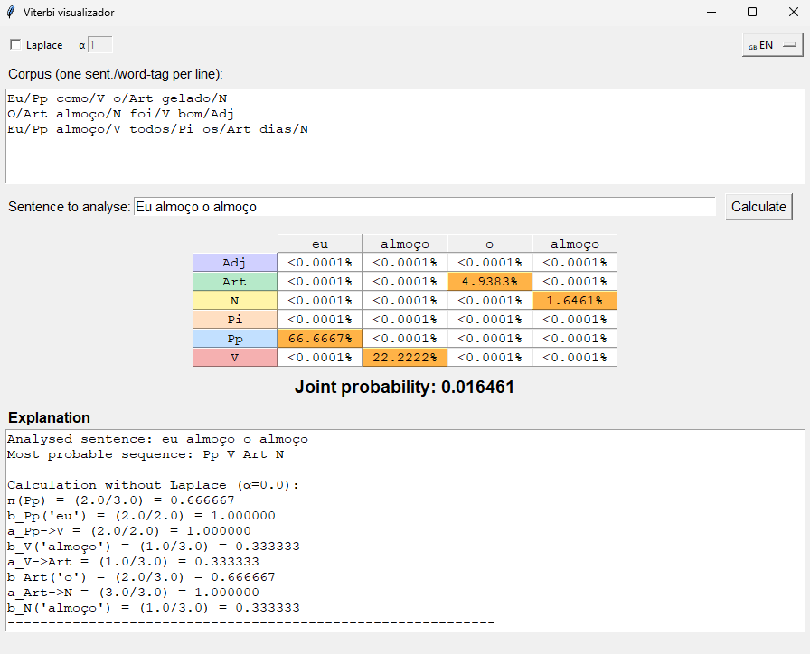

# Viterbi Visualizer GUI App

A user-friendly desktop application for exploring and visualizing the Viterbi algorithm for Hidden Markov Models (HMMs), with support for Laplace smoothing.

🔍 **What’s This Project?**
This lightweight GUI lets you:

- **Train a Hidden Markov Model** on a custom corpus of word/tag pairs.
- **Toggle Laplace smoothing** and adjust the α (alpha) parameter.
- **Enter sentences** to be tagged by part-of-speech (POS) tags.
- **Visualize the Viterbi probability table**, with each state colour-coded and the most probable path highlighted.
- **Inspect a step-by-step explanation** of start, transition, and emission probabilities leading to the final tag sequence.



📚 **What Is the Viterbi Algorithm?**
The Viterbi algorithm computes the most likely sequence of hidden states (e.g., POS tags) given an observed sequence (e.g., words) under a Hidden Markov Model. It’s widely used in natural language processing, speech recognition, and bioinformatics to decode the underlying state sequence efficiently.

**Example Workflow:**

1. **Train HMM**: Provide a corpus where each line contains a word and its tag (e.g., `word/Tag`).
2. **Set α**: Enable Laplace smoothing to handle unseen words and adjust the α value.
3. **Tag Sentence**: Enter a sentence and click **Calculate**.
4. **View Table**: Observe the probability matrix, with cells coloured by tag and the optimal path highlighted.
5. **Read Explanation**: Follow the breakdown of start probabilities, transition probabilities, emission probabilities, and the final joint probability product.

```plaintext
Corpus example:
Eu/Pp como/V o/Art gelado/N
O/Art almoço/N foi/V bom/Adj
Eu/Pp almoço/V todos/Pi os/Art dias/N
```

🚀 **Executable**

A standalone executable is provided in the `dist` directory. Simply run the executable for your platform to launch the application without installing Python.

```bash
# Windows example
./dist/viter_1.exe
```

🛠️ **Requirements & Installation**

git clone <repo-url>
cd <repo-directory>

````
2. (Optional) Create a virtual environment:
   ```bash
python -m venv venv
source venv/bin/activate  # macOS/Linux
venv\Scripts\activate     # Windows
````


📄 **License**

MIT © 2025

Feel free to use, modify, and share!
